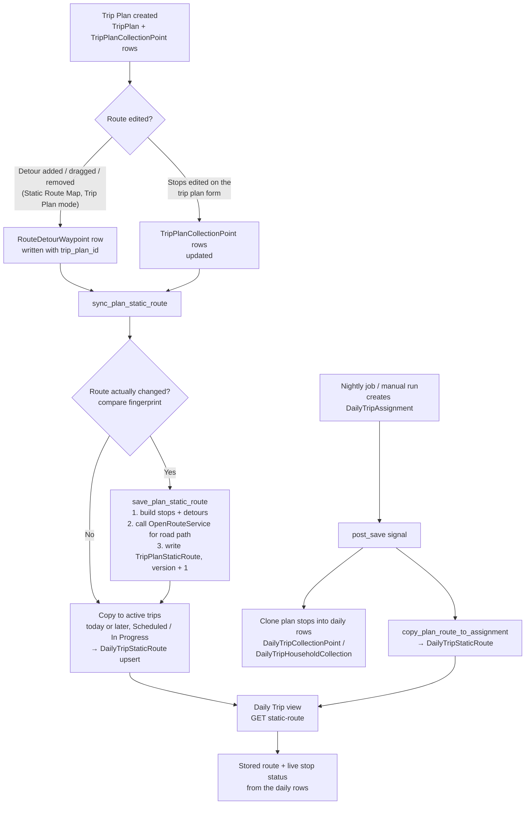
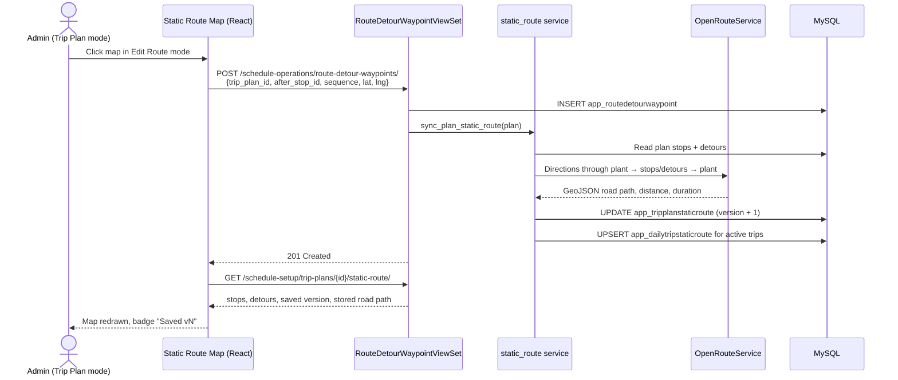
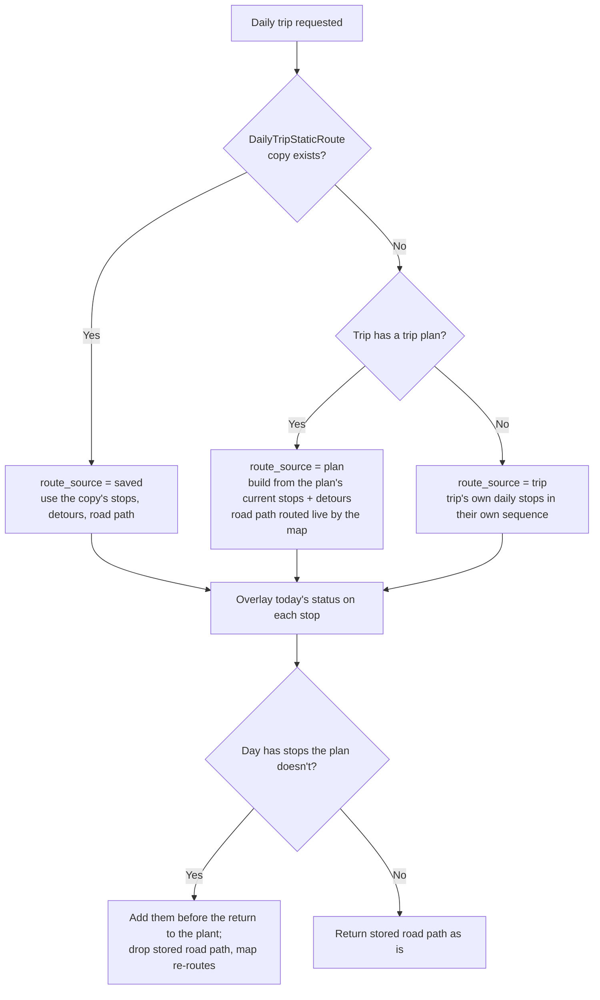
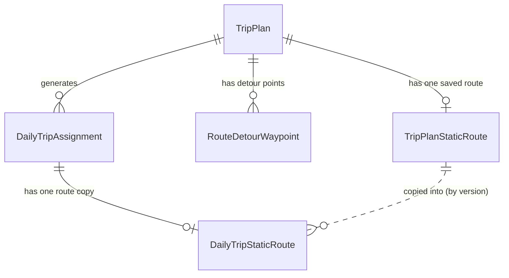

# Static Routes: Trip Plan → Daily Trip

A **static route** is the fixed path a vehicle follows for a trip plan:

```
Plant (start) → stop 1 → stop 2 → … → stop N → Plant (end)
```

plus optional **detour points** that bend the road path around a closed or
blocked road. The route is **drawn and edited on the trip plan only**. Every
daily trip generated from that plan shows the same route, read-only, with
that day's live collection status on each stop.

Routes are stored in the database. A plan's route is re-saved automatically
every time it changes, and each daily trip keeps its own copy.

---

## 1. Rules at a glance

| Rule | Behaviour |
|---|---|
| Where routes are edited | Static Route Map → **Trip Plan** mode → **Edit Route**. Nowhere else. |
| Daily Trip view | Read-only. Shows the plan's route plus the day's stop statuses. **Edit Plan Route** jumps to the plan. |
| Saving | Automatic. Adding, dragging or removing a detour, or editing the plan's stops, re-saves the route as a new version. |
| Which daily trips follow a change | Trips of that plan dated **today or later** with status **Scheduled** or **In Progress**. |
| Which daily trips never change | **Completed** / **Cancelled** trips and trips from past days: they keep the route they ran with. |
| New daily trips | Get a copy of the plan's current saved route the moment they are created. |
| Stop order | Always the trip plan's `sequence`. The map never reorders stops, and `optimize-route` doesn't affect it. |
| Collection status | Never stored in the route. Always read live from the trip's daily rows. |

---

## 2. Overall flow



---

## 3. Editing a route (sequence)



Removing a detour (`DELETE …/route-detour-waypoints/{id}/`) runs the same sync.
Dragging a detour is a delete plus a create, so the version goes up by 2.

---

## 4. Viewing a daily trip (decision flow)

`GET /schedule-operations/daily-trip-collection-points/static-route/?trip_assignment_id=…`
→ `assignment_static_route(assignment)`:



Status overlay:

| Stop situation | Shown as |
|---|---|
| Plan stop present on the day | That day's status, e.g. `Collected`, `Pending`, `In Progress`, `Not Available`. Bin stops list each bin with its status. |
| Plan stop missing from the day | `Not scheduled` |
| Day stop not in the plan | Added after the planned stops, before the return to the plant |

---

## 5. What is stored in the database

Three tables are involved. All use string ids (`CharField`), not real
foreign keys, like the rest of this codebase.



### 5.1 `app_tripplanstaticroute`: the plan's saved route (one row per plan)

Model: `app/models/core_modules/schedule_setup/trip_plan_static_route.py`

| Column | Type | Meaning |
|---|---|---|
| `unique_id` | varchar(30), PK | `TPSR-…` |
| `trip_plan_id` | varchar(30), **unique** | The trip plan this route belongs to |
| `stops` | JSON | Ordered stop list (see 5.4) |
| `detour_waypoints` | JSON | Detour points at the time of saving (see 5.4) |
| `route_geojson` | JSON, nullable | Road path from OpenRouteService. `NULL` if routing failed when saved (the map routes it live). |
| `distance_meters` | float | Total route distance |
| `duration_seconds` | float | Estimated driving time |
| `version` | int | Starts at 1, +1 on every save |
| `saved_at` | datetime | When this version was saved |
| `is_active`, `is_deleted` | bool | Standard soft-delete flags |
| `created_by_id`, `updated_by_id` | varchar(50) | Account that saved it |
| `created_at`, `updated_at` | datetime | Row timestamps |

### 5.2 `app_dailytripstaticroute`: each daily trip's copy (one row per trip)

Model: `app/models/core_modules/daily_operations/daily_trip_static_route.py`

| Column | Type | Meaning |
|---|---|---|
| `unique_id` | varchar(30), PK | `DTSR-…` |
| `trip_assignment_id` | varchar(30), **unique** | The daily trip |
| `trip_plan_id` | varchar(30) | Plan it was copied from |
| `plan_route_version` | int | Which plan version this copy holds |
| `stops`, `detour_waypoints`, `route_geojson`, `distance_meters`, `duration_seconds` | same as 5.1 | Full copy of the plan's saved route |
| `is_active`, `is_deleted`, audit columns | | Standard |

Why a copy and not a pointer? So a **completed or past trip keeps the route it
actually ran with** even after the plan changes. Active trips are refreshed on
every plan save, so in practice they always match the plan.

### 5.3 `app_routedetourwaypoint`: detour points (editable source)

Model: `app/models/core_modules/daily_operations/route_detour_waypoint.py`

| Column | Type | Meaning |
|---|---|---|
| `unique_id` | varchar(30), PK | `RDW-…` |
| `trip_plan_id` | varchar(30), indexed | **Owner.** Required for new detours. |
| `trip_assignment_id` | varchar(30), nullable | Legacy (old per-day detours). No longer written or shown; the API rejects it. |
| `after_stop_id` | varchar(64) | Stop key of the leg the detour belongs to (the stop the leg starts from) |
| `sequence` | int | Order of detours within the same leg |
| `latitude`, `longitude` | decimal(9,6) | Detour position |
| `is_active`, `is_deleted`, audit columns | | Standard |

These rows are the editable source of truth. `TripPlanStaticRoute.detour_waypoints`
is a snapshot of them, taken at each save.

### 5.4 JSON shapes

**Stop keys:** stops are identified by location, not by row id, so a detour
drawn on the plan lands on the same leg in every daily trip:

| Key | Stop |
|---|---|
| `plant:start` | Project's plant, departing (order 1) |
| `cp:<collection_point_id>` | A bin collection point; all its bins collapse into one stop |
| `cust:<customer_id>` | A household / bulk customer |
| `plant:end` | Project's plant, returning (last order) |

**`stops`** (real row from local `SR-PAL-BIN`, trimmed):

```json
[
  { "id": "plant:start", "label": "Palakkad Municipal Waste Processing Yard",
    "type": "plant", "order": 1, "latitude": 10.7735, "longitude": 76.679, "details": {} },
  { "id": "cp:CP-65cc08a06940e41204", "label": "SR · Kalmandapam Junction",
    "type": "collection_point", "order": 2, "latitude": 10.7662, "longitude": 76.6748,
    "details": { "Bins": "Kalmandapam Junction Bin" } },
  { "id": "cp:CP-65cc08a07d2a244672", "label": "SR · Chandranagar Junction",
    "type": "collection_point", "order": 3, "latitude": 10.7585, "longitude": 76.667,
    "details": { "Bins": "Chandranagar Junction Bin" } },
  "…",
  { "id": "plant:end", "label": "Palakkad Municipal Waste Processing Yard",
    "type": "plant", "order": 8, "latitude": 10.7735, "longitude": 76.679, "details": {} }
]
```

`type` is one of `plant`, `collection_point`, `household`.

**`detour_waypoints`:**

```json
[
  { "id": "RDW-65cc08a0c91db55089", "after_stop_id": "cp:CP-65cc08a07d2a244672",
    "sequence": 1, "latitude": 10.7631, "longitude": 76.6603 }
]
```

Rows saved before the day-detour removal also carry `"scope": "plan"`. It's
ignored and disappears on the next save.

**`route_geojson`:** the OpenRouteService Directions response, stored as is:
a `FeatureCollection` with one `LineString` feature (≈ 500 coordinates for a
20 km route) plus `bbox`, `metadata` and per-segment `summary`. About 20 KB per
route.

### 5.5 Not stored in the route tables

| Data | Where it lives |
|---|---|
| Stop collection status, weights, collected time | `app_dailytripcollectionpoint`, `app_dailytriphouseholdcollection`, `app_bincollectionevent`, read live |
| Vehicle position on the map | Latest `BinCollectionEvent` driver coordinates |
| The plan's stop list (editable) | `app_tripplancollectionpoint` |

---

## 6. How a route is built from the plan

`plan_route_stops(plan)` in `app/services/static_route.py`:

1. Read the plan's **active** `TripPlanCollectionPoint` rows of the plan's
   `collection_type`, ordered by `sequence`.
2. **Bin plan:** each row → its collection point. Several bins at one point
   become **one** stop (`cp:…`), with the bin names in `details.Bins`.
3. **Household / bulk plan:** each row expands to customers, either the row's
   `customer_id` or every customer in its zone/ward/panchayat, limited to the
   plan's wards. This is the same rule daily trip generation uses. Each
   customer becomes a `cust:…` stop.
4. Records without usable coordinates (blank, `NaN`) are skipped.
5. Wrap with the project's active `Plant` as `plant:start` and `plant:end`,
   then number `order` 1..N.

The road path is built by inserting each detour after its `after_stop_id`
stop (ordered by `sequence`) and sending the full point list to
OpenRouteService Directions in that order. Nothing is reordered.

**Fingerprint:** a save is skipped when nothing changed. The comparison is
on stop ids and coordinates, plus detour `(after_stop_id, sequence, lat, lng)`,
not detour row ids.

---

## 7. API reference

| Method | Endpoint | Purpose |
|---|---|---|
| GET | `/api/v1/schedule-setup/trip-plans/{id}/static-route/` | Plan's route as drawn, plus `saved` (version, saved_at, distance, duration), `has_unsaved_changes`, and `route_geojson` when it matches the drawing |
| POST | `/api/v1/schedule-operations/trip-plan-static-routes/` `{trip_plan_id}` | Manual **Save Route** (shown only when the drawing differs from the stored route). Returns `version`, `updated_trip_count`, `routing_error`. |
| GET | `/api/v1/schedule-operations/trip-plan-static-routes/?trip_plan_id=` | List saved routes |
| POST | `/api/v1/schedule-operations/route-detour-waypoints/` | Add a plan detour (`trip_plan_id` required; `trip_assignment_id` → 400). Auto-syncs. |
| DELETE | `/api/v1/schedule-operations/route-detour-waypoints/{id}/` | Remove a plan detour. Auto-syncs. |
| GET | `/api/v1/schedule-operations/daily-trip-collection-points/static-route/?trip_assignment_id=` | One daily trip's route: `route_source`, `plan_route_version`, `stops` with status, `detour_waypoints`, `route_geojson`, distance, duration |
| GET | `/api/v1/schedule-operations/daily-trip-collection-points/static-routes/?company_id=&project_id=&date=` | All routes view (max 30 trips) |
| POST | `/api/v1/schedule-operations/daily-trip-collection-points/route-static/` | Road path for a given point list (used when no stored path fits) |

Permissions: both route resources (`RouteDetourWaypoint`, `TripPlanStaticRoute`)
are granted through the **Static Route Map** screen (`schedule-operations/static-route-map`).
Editing needs its Add/Delete actions; viewing needs View.

---

## 8. Files changed

### Backend (`iwms-backend`)

| File | Change |
|---|---|
| `app/services/static_route.py` | **New.** All route logic: build plan route, fingerprint, save, sync, copy to trips, daily view with status overlay, legacy id mapping |
| `app/models/core_modules/schedule_setup/trip_plan_static_route.py` | **New.** `TripPlanStaticRoute` |
| `app/models/core_modules/daily_operations/daily_trip_static_route.py` | **New.** `DailyTripStaticRoute` |
| `app/models/core_modules/daily_operations/route_detour_waypoint.py` | Added `trip_plan_id`; `trip_assignment_id` nullable (legacy); `after_stop_id` 30 → 64 chars for stop keys |
| `app/serializers/core_modules/schedule_setup/trip_plan_static_route_serializer.py` | **New.** Read-only serializer |
| `app/serializers/core_modules/daily_operations/route_detour_waypoint_serializer.py` | Requires `trip_plan_id`; rejects `trip_assignment_id` |
| `app/viewsets/core_modules/schedule_setup/trip_plan_static_route_viewset.py` | **New.** Save Route endpoint with audit logging |
| `app/viewsets/core_modules/schedule_setup/trip_plan_viewset.py` | `static-route` action; auto-sync after plan update |
| `app/viewsets/core_modules/daily_operations/route_detour_waypoint_viewset.py` | `trip_plan_id` filter; auto-sync on create/delete |
| `app/viewsets/core_modules/daily_operations/daily_trip_collection_point_viewset.py` | `static-route` / `static-routes` use the service; no longer create rows on read |
| `app/signals/trip_plan_signals.py` | New daily trip → copy plan's saved route |
| `app/urls/base_urls.py` | Registered `trip-plan-static-routes` |
| `app/middleware/module_permission_middleware.py` | Allowlisted `TripPlanStaticRoute` |
| `app/utils/screen_dependencies.py` | Static Route Map includes both route resources; looks up trip plans |
| `app/utils/cascade_soft_delete.py`, `trip_plan.py`, `daily_trip_assignment.py` | Soft-delete cascades to routes and detours |
| `app/models/__init__.py` | Registered new models |
| `app/management/commands/seed_static_route_samples.py` | **New.** Sample data: 2 plans (bin + household) per project with today's trips |
| `app/migrations/0005_route_detour_waypoint_trip_plan.py` | Detour table changes (idempotent: safe on DBs that already have the column) |
| `app/migrations/0006_static_route_storage.py` | Creates the two route tables |
| `tests/schedule_setup/test_static_route.py` | **New.** Route build, save, sync, copy rules, read-only daily view, endpoints |
| `tests/test_middleware/test_module_permission_middleware.py` | Save Route permission test |

### Frontend (`iwms-frontend`, `src/pages/admin/modules/core_modules/dailyOperations/staticRouteMap/`)

| File | Change |
|---|---|
| `StaticRouteMap.tsx` | Trip Plan / Daily Trip switch, plan picker, save status badge, Save Route (only when needed), Edit Route in plan mode only, read-only daily view with **Edit Plan Route** link |
| `useStaticRoutes.ts` | Plan mode fetch; uses stored road path when available, otherwise routes live |
| `useRouteDetourEditor.ts` | Writes detours against the trip plan only |
| `StaticRouteMapView.tsx` | Household stop markers |
| `types.ts` | `household` stop type, route storage info |
| `src/helpers/admin/endpoints.ts`, `index.ts` | `tripPlanStaticRouteApi` |

---

## 9. Setup and operations

```bash
# migrations are gitignored (**/migrations/*): generate/apply per environment
python manage.py migrate app

# optional sample data (2 plans + today's trip per project, idempotent)
python manage.py seed_static_route_samples
```

- **`ORS_API_KEY`** must be set for road paths. Without it the route is still
  saved (`route_geojson = NULL`) and the map draws it live, or with straight
  lines if routing is unavailable there too.
- **Existing plans** have no saved route until a detour is drawn or
  **Save Route** is clicked. Until then their daily trips follow the plan's
  current drawing (`route_source = plan`).
- **Plan form edits** (stops) re-save only plans that already have a saved route.

---

## 10. Troubleshooting

| Symptom | Check |
|---|---|
| Daily trip doesn't show a plan change | Trip status/date. Completed, Cancelled and past trips are frozen by design. Compare `plan_route_version` (daily) with the plan's `version`. |
| Map shows straight lines | `ORS_API_KEY` missing or OpenRouteService down; `route_geojson` is `NULL`. |
| A customer is missing from a household route | Its latitude/longitude is blank or `NaN`, or it's outside the plan's wards. |
| No plant at start/end | Project has no active `Plant` row. |
| `Duplicate column name 'trip_plan_id'` on migrate | Old DB with an earlier experimental migration. Current 0005 checks first; if a partial run left it half-applied, finish with `migrate app 0005_route_detour_waypoint_trip_plan --fake`. |

```sql
-- versions of a plan and its trips
SELECT p.display_code, r.version, r.saved_at
FROM app_tripplanstaticroute r JOIN app_tripplan p ON p.unique_id = r.trip_plan_id;

SELECT trip_assignment_id, plan_route_version, ROUND(distance_meters/1000,1) AS km
FROM app_dailytripstaticroute WHERE trip_plan_id = '<TPLAN-…>';
```
